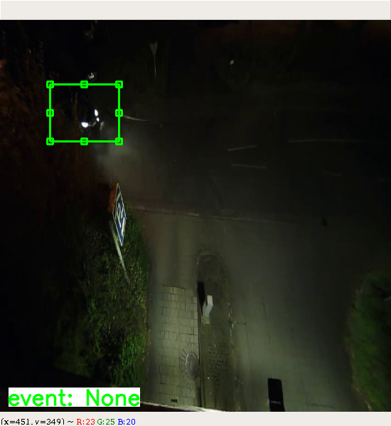

# OpenCV Video Labeling Tool
> Video labeling tool based on OpenCV. Easily customizable.



The idea behind the project is to create a labeling to for videos, which is fully based on Python + OpenCV and thus very easy to customize. The whole labelling pipeline can easily be changed or parts can be replaced or added.

## Installation


With VirtualEnv:

```sh
virtualenv --python=/usr/bin/python3.6 venv
source venv/bin/activate
pip install -r requirements.txt
```

## Usage example

Run with video and config as mandatory input:

```sh
python main.py data/example_video.avi data/example_config.json
```
Optional add output path with -o/--output:
```sh
python main.py data/example_video.avi data/example_config.json -o results/output.json
```
If classifier is added (in label_tool/classifier.py), activate "pre-classification" with -c/--classify:
```sh
python main.py data/example_video.avi data/example_config.json --classify
```

## Release History

* 1.0.0
    * First public version.

## Contributing

1. Fork it (<https://github.com/yourname/yourproject/fork>)
2. Create your feature branch (`git checkout -b feature/fooBar`)
3. Commit your changes (`git commit -am 'Add some fooBar'`)
4. Push to the branch (`git push origin feature/fooBar`)
5. Create a new Pull Request

## Open Tasks:
- fix tracker bug
- add example classifier
- different colors for different types of rois

## Meta

Distributed under the MIT license. See ``LICENSE`` for more information.

[https://github.com/yourname/github-link](https://github.com/dbader/)